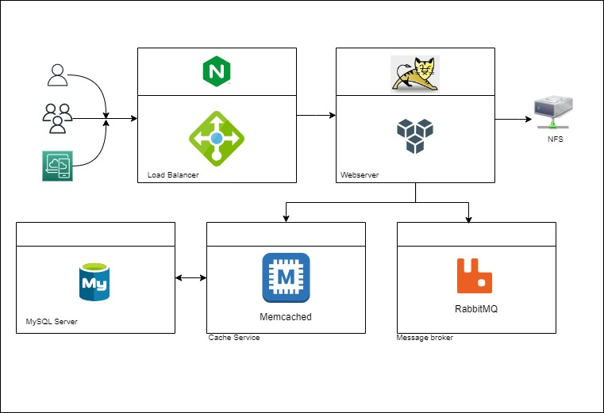

# VProfile-Local

## Objective:
VProfile-Local is a web application stack designed for local development, aiming to handle multiple services. finally to automate the setup process using Infrastructure as Code (IaC).

## Architecture:


## The Stack:
| Tool           | Use                   | Why Choose It                 |
| -------------- | --------------------- | ----------------------------- |
| 🧊 VirtualBox  | Hypervisor for Virtualization | Easy to use           |
| 🆅 Vagrant  | Automation            | Lightweight                   |
| 🐧 Linux (Ubuntu) | OS                  | Popular Linux distribution   |
| 🐧 Linux (CentOS 9) | OS                | Popular Linux distribution   |
| 🌐 Nginx       | Load Balancer         | Web Service                  |
| 🐈 Apache Tomcat | Application Server  | Popular for Java apps        |
| 📨 RabbitMQ    | Broker/Queuing Agent  | For messaging tasks          |
| Ⓜ️ Memcached   | DB Caching            | For database caching         |
| 🐬 MySQL Server | SQL Database         | For data storage             |

## Prerequisites:
- Computer with at least 8GB RAM and approximately 10GB of free disk space (for running Linux in a virtual machine).
- Oracle VM VirtualBox
- Vagrant
- Vagrant plugin - vagrant-hostmanager (Adds hostnames and IP addresses from the Vagrantfile to every VM hostfile, i.e., `/etc/hosts`).
- Git bash

## Getting Started:
1. Clone the source code:
   ```bash
   git clone -b main https://github.com/myacov/vprofile-local.git
   ```
2. Bring up the virtual machines
   ```bash
    vagrant up
   ```

## Setup VMs
### A. MYSQL Setup
1. Login to the 'db01' VM:
    ```bash
    vagrant ssh db01
    ```
2. Verify the hosts entry; if entries are missing, update them with the appropriate IP and hostnames:
    ```bash
    cat /etc/hosts
    ```
3. Update the OS with the latest patches:
    ```bash
    sudo yum update -y
    ```
4. Set up the repository:
    ```bash
    sudo yum install epel-release -y
    ```
5. Install MariaDB:
    ```bash
    sudo yum install git mariadb-server -y
    ```
6. Start and enable the MariaDB server:
    ```bash
    sudo systemctl start mariadb
    sudo systemctl enable mariadb
    sudo systemctl status mariadb
    ```
7. Run the MySQL secure installation script:
    ```bash
    sudo mysql_secure_installation
    ```
    > NOTE: Set db root password Example password : admin123
8. Setup Database name and users.
    ```bash
    mysql -u root -padmin123
    ```

grant privileges to user admin (% = remote)
```sql
sql>    create database accounts;
sql>    grant all privileges on accounts.* TO 'admin'@'%' identified by 'admin123' ;
sql>    FLUSH PRIVILEGES;
sql>    exit;
```

9. Download Source code & Initialize Database.
```bash
sudo -i
git clone -b main https://github.com/myacov/vprofile-local.git
cd vprofile-local
mysql -u root -padmin123 accounts < src/main/resources/db_backup.sql
mysql -u root -padmin123 accounts
```
```sql
sql>    show tables;
```

10. Restart the MariaDB server:
```bash
systemctl restart mariadb
```

### B. Memcache Setup
1. Login to the 'mc01' vm
    ```bash
    vagrant ssh mc01
    ```
2. Install, start, and enable Memcached on port 11211:
```bash
sudo -i
dnf install epel-release -y
dnf install memcached -y
systemctl start memcached
systemctl enable memcached
systemctl status memcached
```
3. Allow listening for connections from different VMs (for Tomcat):
```bash 
sed -i 's/127.0.0.1/0.0.0.0/g' /etc/sysconfig/memcached
sudo systemctl restart memcached
``` 

### C. RabbitMQ Setup
1. Login to the RabbitMQ vm
```bash
    vagrant ssh rmq01
```
2. Update the OS and set up the EPEL repository:
```bash
    sudo -i
    yum update -y
    yum install epel-release -y
```
3. Install Dependencies and RabbitMQ repository:
 ```bash
    dnf -y install centos-release-rabbitmq-38
```
4. Enable RabbitMQ repositry and instll rabbitMQ Server
```bash
    dnf --enablerepo=centos-rabbitmq-38 -y install rabbitmq-server
```
5. Start and Enable RabbitMQ Server
```bash
    systemctl start rabbitmq-server
    systemctl enable rabbitmq-server
    systemctl status rabbitmq-server
```
6. For VProfile-specific configuration, create a file and redirect output:
 ```bash
    sh -c 'echo "[{rabbit, [{loopback_users, []}]}]." > /etc/rabbitmq/rabbitmq.config'
```
7. RabbitMQ commands - add user and set "administrator" tag . then restart the service
 ```bash
    rabbitmqctl add_user test test
    rabbitmqctl set_user_tags test administrator
    systemctl restart rabbitmq-server
```
### D. Tomcat Setup
1. **Setting up Tomcat Service**
    1. Login to the Tomcat vm
    ```bash
        vagrant ssh app01
    ```
    2. Update the OS:
    ```bash
        sudo yum update -y
    ```
    3. Set up the repository:
    ```bash
        sudo yum install epel-release -y
    ```
    4. Install Dependencies: OpenJDK 11, Git, Wget, and Maven:
    ```bash
        dnf -y install java-11-openjdk java-11-openjdk-devel
        dnf install git maven wget -y
    ```
    5. Download & Install Tomcat Package
    ```bash
        cd /tmp/
        wget https://archive.apache.org/dist/tomcat/tomcat-9/v9.0.75/bin/apache-tomcat-9.0.75.tar.gz
        tar xzvf apache-tomcat-9.0.75.tar.gz
        useradd --home-dir /usr/local/tomcat --shell /sbin/nologin tomcat
        cp -r /tmp/apache-tomcat-9.0.75/* /usr/local/tomcat/
        chown -R tomcat.tomcat /usr/local/tomcat
    ```
    6. Setup systemctl command for Tomcat:
        Copy and paste the following script to **tomcat.service** file (*path*= **/etc/systemd/system/tomcat.service**):
    ```bash
        [Unit]
        Description=Tomcat
        After=network.target
        [Service]
        User=tomcat
        WorkingDirectory=/usr/local/tomcat
        Environment=JRE_HOME=/usr/lib/jvm/jre
        Environment=JAVA_HOME=/usr/lib/jvm/jre
        Environment=CATALINA_HOME=/usr/local/tomcat
        Environment=CATALINE_BASE=/usr/local/tomcat
        ExecStart=/usr/local/tomcat/bin/catalina.sh run
        ExecStop=/usr/local/tomcat/bin/shutdown.sh
        SyslogIdentifier=tomcat-%i
        [Install]
        WantedBy=multi-user.target
    ```
    7. Reload systemd files, then start and enable the Tomcat service:
    ```bash
        systemctl daemon-reload
        systemctl start tomcat
        systemctl enable tomcat
    ```
2. **Building & Deploying the Application on Tomcat:**
    1. Download Source code
        ```bash
            git clone -b main https://github.com/myacov/vprofile-local.git
        ```
    2. Build the code:
        ```bash
            cd vprofile-local
            mvn install
        ```
    3. Deploy the artifact:
        ```bash
            systemctl stop tomcat
            rm -rf /usr/local/tomcat/webapps/ROOT*
            cp target/vprofile-v2.war /usr/local/tomcat/webapps/ROOT.war
            systemctl start tomcat
        ```

### E. Nginx Setup
1. Login to the Nginx vm
```bash
    vagrant ssh web01
```
2. Update the OS and install Nginx:
```bash
    sudo -i
    apt update
    apt upgrade -y
    apt install nginx -y
```
3. Create an Nginx conf file and copy and paste the following script (*path*= **/etc/nginx/sites-available/vproapp**)::
```bash
    upstream vproapp {
      server app01:8080;
    }
    server {
       listen 80;
       location / {
     proxy_pass http://vproapp;
    }
   }
```
4. Remove the default Nginx configuration link:
```bash
    rm -rf /etc/nginx/sites-enabled/default
```
5. Create a symbolic link to our configuration:
```bash
    ln -s /etc/nginx/sites-available/vproapp  /etc/nginx/sites-enabled/vproapp
```
6. Restart Nginx:
```bash
    systemctl restart nginx
```

## Automating this process - Provisioning

The automated branch includes shell scripts for the Vagrantfile to execute during the provisioning stage.


## License:
This project is licensed under the MIT License.